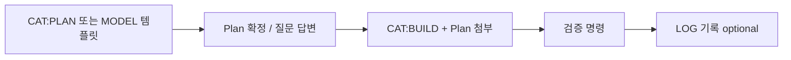

# Cursor 프롬프트 템플릿 (JCC-SEOUL-USER)

Cursor에 요청할 때 **복사·붙여넣기**해서 쓰는 템플릿 모음입니다.  
함수명을 몰라도 됩니다. **화면 경로 · 기준 페이지 · PC/mobile · 앱 범위**가 더 중요합니다.

관련 규칙: [AGENTS.md](../AGENTS.md), [.cursor/README.md](../.cursor/README.md), [.cursor/rules/13-jcc-frontend-ui.mdc](../.cursor/rules/13-jcc-frontend-ui.mdc), [.cursor/rules/11-jcc-permissions.mdc](../.cursor/rules/11-jcc-permissions.mdc)

---

## 목차

1. [빠른 시작 (4줄)](#1-빠른-시작-4줄)
2. [카테고리 태그](#2-카테고리-태그)
3. [복붙 템플릿 8종](#3-복붙-템플릿-8종)
4. [프로젝트 치환表](#4-프로젝트-치환表)
5. [피할 패턴](#5-피할-패턴)
6. [Plan → Build 2단계](#6-plan--build-2단계)
7. [요청 기록 형식 (템플릿 진화용)](#7-요청-기록-형식-템플릿-진화용)
8. [Changelog / 예시 모음](#8-changelog--예시-모음)

---

## 1. 빠른 시작 (4줄)

가장 짧게 쓸 때 — 아래 4줄만 채워서 보내면 됩니다.

```text
[CAT:UI] {카테고리: UI | VIEW | API | MODEL | PERM | FEAT | BUG}

[어디] {메뉴경로}  예: 공지사항 > 수정 / 수련회 > 관리 > 타임테이블

[뭐가 문제] {한 문장 증상}  (스크린샷 있으면 첨부)

[완료] {검증 가능한 기준}  예: 리스트·상세·수정 3페이지 헤더 위치 동일
```

---

## 2. 카테고리 태그

첫 줄에 `[CAT:…]`를 붙이면 AI가 범위·모드를 잡기 쉽습니다.

| 태그 | 언제 쓰나 | 주로 건드리는 레이어 |
|------|-----------|----------------------|
| `[CAT:UI]` | 레이아웃, CSS, 반응형, 버튼·헤더·탭 | `app/templates/`, static CSS/JS |
| `[CAT:VIEW]` | 페이지 저장·redirect·폼 POST | `views/`, template 일부 |
| `[CAT:API]` | JSON API, serializer, DRF 권한 | `apis/`, `urls.py` |
| `[CAT:MODEL]` | 모델·마이그레이션·관계 설계 | `models/`, migrations |
| `[CAT:PERM]` | 누가 보고/쓰고/삭제하는지 | `users/permissions.py`, 뷰·API·메뉴 |
| `[CAT:FEAT]` | UI+로직 혼합, 업무 시나리오 | 앱별 혼합 |
| `[CAT:BUG]` | 에러, 재현, follow-up | traceback @ 첨부 |
| `[CAT:PLAN]` | 구현 전 설계·질문만 | 편집 X |
| `[CAT:BUILD]` | 확정된 Plan 실행 | Plan 첨부 |

**Ask vs Agent**

- 설명·원인만: Ask 모드 + `[CAT:…]` + “코드 수정하지 마”
- 고치기·추가: Agent 모드 + 템플릿 + `[금지]` / `[검증]`

---

## 3. 복붙 템플릿 8종

### 3-1. `[CAT:UI]` — 프론트엔드 UI

```text
[CAT:UI]

[화면] {메뉴경로}  예: 공지사항 > 리스트 / 상세 / 수정 / 타임테이블

[기준] {기준페이지} 와 동일하게
  예: 수련회 > 대시보드 헤더 + 하위 탭
  예: 수련회 > 픽업 모바일 +차량 요청 FAB 버튼 (크기·색·위치)

[PC]
  -

[mobile]
  -

[완료]
  -

[금지] 다른 앱 리팩터 X / {앱}만

[참고] @app/templates/includes/jcc_page_header.html (공통 헤더 있을 때)
```

**UI는 한 화면(또는 같은 기능 2~4페이지)씩.**  
“전체 페이지 일치”는 공통 컴포넌트 추출 **마지막 턴**에 요청.

---

### 3-2. `[CAT:VIEW]` — Django 템플릿 뷰

```text
[CAT:VIEW]

[화면] {메뉴경로}

[증상] {클릭/저장 후 무슨 일이}
[기대] {원하는 동작}

[URL] (알면) /retreat/.../  또는 화면명

[범위] views/ + template / views/ 만 / form 포함

[금지] CSS 전역 수정 X, 다른 앱 X

[검증] cd app && poetry run python manage.py check
```

---

### 3-3. `[CAT:API]` — DRF JSON API

```text
[CAT:API]

[엔드포인트] api/v1/{attendance|org}/...

[증상] {HTTP 코드 / 응답 / 기대와 다른 필드}
[기대] {status, payload, 권한}

[범위] {앱}/apis/ + serializer + test

[권한] (해당 시)
  - 출석·부서: visible_divisions_for, visible_teams_for
  - 교적: can_access_member_registry (목사·전도사)
  - users/permissions.py 패턴 따르기

[금지] config/urls.py에 직접 라우트 추가 X → 앱 urls.py만

[검증] cd app && poetry run python manage.py test {앱} -v 1
```

---

### 3-4. `[CAT:MODEL]` — 데이터 모델링

큰 설계는 **Plan 먼저** 권장. Region·Retreat 도입 때 쓰던 형식.

```text
[CAT:MODEL]

## 배경
-

## 목표
1.
2.

## 제약/원칙
- 기존 데이터 손실 없음 (백필 마이그레이션)
- users/permissions.py 기존 함수 동작 유지 (또는 명시적 변경)
- 마이그레이션 번호: {앱}/migrations/000N_...

## 작업
- TodoWrite 단계 (한글)
-

## 질문 (Plan 모드)
- {User vs Profile FK? / 스냅샷 분리? 등}

[금지] lockfile, 무관 앱 리팩터 X
```

---

### 3-5. `[CAT:PERM]` — 권한

```text
[CAT:PERM]

[기능] {메뉴/화면/API 이름}

| 역할 | 목록 | 상세 | 작성 | 수정 | 삭제 | 메뉴 노출 |
|------|------|------|------|------|------|-----------|
| 비로그인 | | | | | | |
| 승인 반려 | | | | | | |
| 일반 참가자 | | | | | | |
| {커스텀 권한} | | | | | | |
| staff / superuser | | | | | | |
| 목사 / 전도사 | | | | | | |

[원칙]
- users/permissions.py 패턴
- API · 뷰 · 버튼 노출 · 좌측 메뉴 **동일**하게

[범위] {앱}만

[Plan] 권한 관련이면 구현 전 Plan 모드로 매트릭스 확인 먼저
```

역할 목록 참고: `.cursor/rules/11-jcc-permissions.mdc` (@PERM)

---

### 3-6. `[CAT:FEAT]` — 기능 구현 (UI + 로직)

출석 마감·조원 추가처럼 **업무 시나리오**가 길 때.

```text
[CAT:FEAT]

[기능] {앱} — {한 줄 요약}

[현재]
-

[기대]
-

[예외 / edge case]
- 재오픈 시?
- 마감 / 진행중 동시?
-

[권한]
- {역할}만 {동작}

[범위] {앱}만. {다른 앱} 건드리지 말 것

[UI] (필요 시) [CAT:UI] 블록 일부만 인용

[검증] cd app && poetry run python manage.py test {앱}.tests.{모듈} -v 1
```

---

### 3-7. `[CAT:BUG]` — 버그 · 에러

```text
[CAT:BUG]

[화면] {메뉴경로}

[증상] {한 문장}

[재현]
1.
2.

[에러] @terminals/{id}.txt (traceback 줄 범위)

[기대]

[이전 시도] (follow-up일 때) 지난번에 ~ 수정했는데 여전히 ~

[범위] {관련 앱/파일 후보만}
```

---

### 3-8. `[CAT:PLAN]` / `[CAT:BUILD]` — 2단계

**Plan (편집 전)**

```text
[CAT:PLAN]

{MODEL | FEAT | PERM} 관련 — 구현 전 계획만 제시해줘. 아직 코드 수정하지 마.

[배경]
[목표]
[제약]
[결정 필요] {AI에게 물어볼 선택지}

위험·롤백·검증 명령 포함.
```

**Build (Plan 확정 후)**

```text
[CAT:BUILD]

{Plan 제목}

Implement the plan as specified, it is attached for your reference.
Do NOT edit the plan file itself.

To-do's from the plan have already been created. Do not create them again.
Mark them as in_progress as you work, starting with the first one.
Don't stop until you have completed all the to-dos.
```

---

## 4. 프로젝트 치환表

| placeholder | 예시 |
|-------------|------|
| `{메뉴경로}` | 수련회 > 관리 > 조 / 공지사항 > 타임테이블 / 계정관리 > 계정 |
| `{기준페이지}` | 수련회 대시보드 헤더 / 픽업 모바일 FAB / 출석 대시보드 툴바 |
| `{앱}` | `notices` / `retreat` / `attendance` / `registry` / `users` |
| `{레이어}` | templates only / views / apis / models |
| `{검증}` | `manage.py check` / `manage.py test {앱} -v 1` |

**앱별 코드 탐색 순서**

`importers/` → `management/commands/` → `models/` → **`apis/`** (DRF) / **`views/`** (템플릿)

**URL 위치**

- 출석 API: `app/attendance/urls.py` (`api/v1/attendance/…`)
- 조직 API: `app/registry/urls.py` (`api/v1/org/…`)
- Django 실행: `cd app && poetry run python manage.py …`

**자주 쓰는 기준 UI**

- 공통 헤더: `app/templates/includes/jcc_page_header.html`
- 좌측 메뉴: `app/templates/includes/jcc_left_nav.html`
- 공지 하위 탭: `app/templates/includes/notice_bottom_tabs.html`

**PC / mobile 구분**

- 브레이크포인트 관례: mobile `<=640px` (`.cursor/rules/13-jcc-frontend-ui.mdc`)
- 프롬프트에 `[PC]` / `[mobile]` **항상 분리** — 상충 시 우선순위 명시  
  예: “mobile은 page-tab 숨김, PC만 헤더 안 탭 유지”

---

## 5. 피할 패턴

로그에서 **느리거나 되돌림**이 많았던 요청 유형.

| 피하기 | 대신 |
|--------|------|
| `손봐줘`, `이상하네`, 이미지만 | 4줄 최소 템플릿 + 기대 동작 |
| `전체 코드 분석`, `전부 적용` | 앱 1개 · 화면 1개 · 증상 1개 |
| UI + 권한 + API + 네비 한 턴 | 2~3턴으로 분리 |
| `mobile tab 없애` ↔ `전부 일치` (상충) | 우선순위 한 줄 명시 |
| 같은 메시지 2~3번 연속 | follow-up에 `[이전 시도]` 추가 |
| 함수명 찾느라 시간 쓰기 | `{메뉴경로}` + `@기준템플릿` |

---

## 6. Plan → Build 2단계

복잡한 작업(모델·권한·출석 마감·S3 연동 등)은 아래 순서가 가장 잘 맞았습니다.



1. **Plan**: `[CAT:PLAN]` 또는 `[CAT:MODEL]` — “코드 수정하지 마”
2. **결정**: AI 질문에 답 / Plan 파일 확정
3. **Build**: `[CAT:BUILD]` + Plan 첨부
4. **Follow-up**: `[CAT:BUG]` 또는 `[CAT:UI]` — 범위 좁혀서

---

## 7. 요청 기록 형식 (템플릿 진화용)

작업 끝난 뒤 **30초 메모** — 아래 블록을 문서 하단 Changelog에 붙이면,  
나중에 “로그 분석해서 템플릿 개선해줘” 할 때 훨씬 정확합니다.

```text
[LOG]
date: YYYY-MM-DD
cat: UI | VIEW | API | MODEL | PERM | FEAT | BUG
screen: {메뉴경로}
prompt_style: 4줄 | 구조화스펙 | Plan+Build | 이미지+기준페이지 | ...
outcome: success | partial | failed | rework
turns: {대략 턴 수}
notes: {뭐가 잘 됐 / 뭐가 막혔}
template_gap: {다음에 템플릿에 넣을 필드·문구}
```

### 필드 설명

| 필드 | 용도 |
|------|------|
| `cat` / `screen` | 카테고리별·화면별 템플릿 개선 집계 |
| `prompt_style` | 어떤 형식이 빨랐는지 비교 |
| `outcome` / `turns` | 짧은 요청 vs 구조화 요청 효율 |
| `template_gap` | v2 템플릿에 추가할 항목 |

### 운영 (수동, 월 1회 정도)

1. 작업 후 `[LOG]` 1개 작성 → 아래 **Changelog**에 append  
2. 또는 Cursor에: *“이번 대화 [LOG] 형식으로 요약해줘”* → 붙여넣기  
3. 쌓이면: *“docs/cursor-prompt-templates.md changelog 보고 템플릿 v2 제안해줘”*

### 기록 피하기

- 함수명만 / 이미지만 / “안 됨”만 → `template_gap` 채우기 어려움

---

## 8. Changelog / 예시 모음

### 패턴 요약 (초기 — 실제 로그 기반)

| 패턴 | 결과 | 템플릿 교훈 |
|------|------|-------------|
| Region 도입 `## 배경/목표/제약` | 1~2턴 성공 | MODEL/대규모 FEAT는 구조화 스펙 |
| 공지 헤더 “전체 코드 분석해서 일치” | 다턴·회귀 | UI는 화면 묶음 + `@jcc_page_header` |
| 출석 마감 `[현재][기대][예외]` + Plan→Build | 성공 | FEAT 4블록 + 2단계 |
| “손봐줘” + 스크린샷만 | 여러 턴 | 4줄 + `[완료]` 필수 |
| mobile tab 제거 ↔ 전 페이지 tab 일치 | 상충·되돌림 | PC/mobile 우선순위 명시 |

---

### Changelog (여기에 [LOG] append)

<!-- 아래에 새 LOG 블록을 날짜순으로 추가 -->

```text
[LOG]
date: 2026-06-17
cat: META
screen: (문서)
prompt_style: 로그 분석 + 카테고리별 템플릿
outcome: success
turns: 1
notes: 함수명 없이 메뉴경로·기준페이지·PC/mobile 중심 템플릿 정리
template_gap: 실사용 LOG 3~5개 쌓이면 v2 필드 검토
```

---

## 부록: 한 턴에 여러 카테고리일 때

**권장 순서** (각각 별도 Agent 턴):

1. `[CAT:PERM]` 또는 Plan  
2. `[CAT:FEAT]` / `[CAT:API]` / `[CAT:VIEW]`  
3. `[CAT:UI]`  

권한·로직이 맞은 뒤 UI polish — 회귀가 적습니다.

---

*문서 버전: v1 (2026-06-17)*
